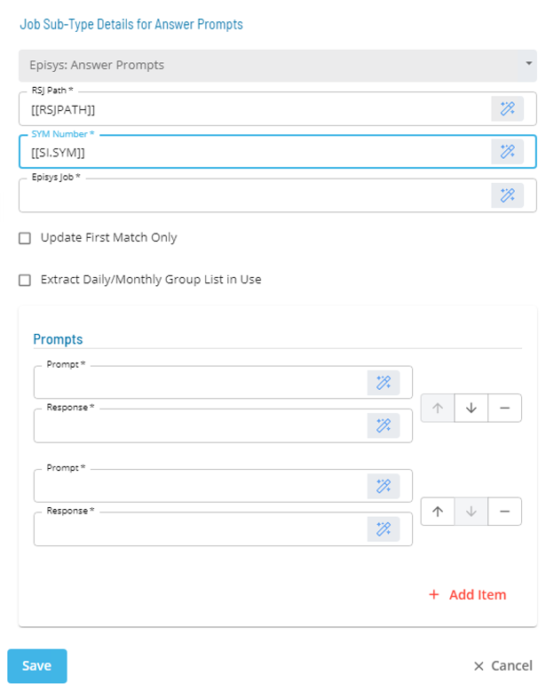

# Episys: Answer Prompts

* Calls an RSJ Utility called **update_scf**
* It updates a Batch Control File with answers to one or more prompts
* Prompts can be found by utilizing a utility called **find_prompts**

### Sub-Type

<!--

-->

| Field | Required / Optional | Description |
| --- | --- | --- |
| RSJ Path | Required | Defines the path to the directory on the UNIX Machine where the RSJ programs are installed. |
| SYM Number | Required | Defines the Episys "SYM" where the control file resides. The value should be a three-digit number or an OpCon token that resolves to a three-digit number. |
| Episys Job | Required | Defines the name of the job in Episys which contains the prompt(s) requiring answers. The name of the job is used to identify the Control File to update. |
| Update First Match Only  | Optional | Determines if the job will update only the first match for each prompt or if it will update all matches for each prompt. |
| Prompt/Response | Required | Defines the text for a Prompt and Response the Episys job will require. |

:::tip Best Practice

It is best practice to store the path to RSJ in a **Global Property**, 

* **RSJPath** = ```/ops/bin```

and to store the SYM### as a **Schedule Instance**,

* **SYM** = ```000```

:::

### Update_scf Syntax

* ```/ops/bin/update_scf -f/SYM/SYM[[SI.SYM]]/BATCH/JOB.NAME "Prompt1:Answer1" "Prompt2:Answer2"```

| Parameter |	Required / Optional | Description |
| --- | --- | --- |
| -f | Required | Specify the path and the file of the batch file to update |
| -s | Optional | Will only update the first matching prompt, otherwise all matching prompts will be updated |
| PromptX:AnswerX | Required | Surrounded in quotes, Defines the text for a Prompt and Response the Episys job will require. |

:::tip Examples

Here are some command line examples:

* ```/ops/bin/update_scf -f/SYM/SYM[[SI.SYM]]/BATCH/CC.LATE/FEE "Effective Date:[[$SCHEDULE DATE MMDDYY]]" "Date:047"```
* ```/ops/bin/update_scf -f/SYM/SYM[[SI.SYM]]/BATCH/DRAFTS "Effective Date:[[$SCHEDULE DATE MMDDYY]]"```

:::