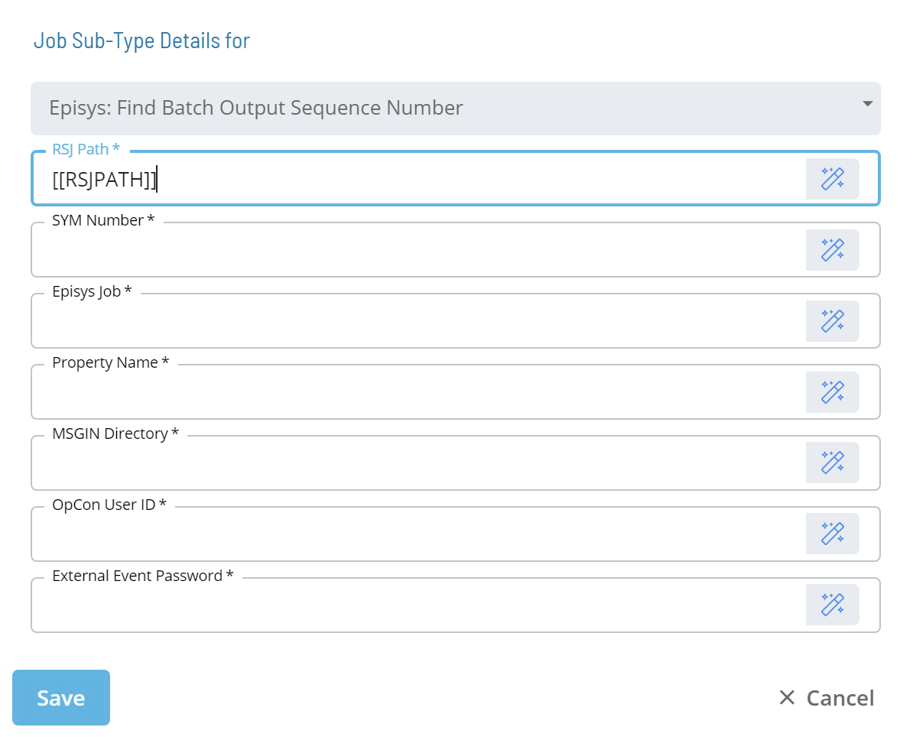

# Episys: Find Batch Report Sequence Number

* Recommended to use **Find Report from RSJ Output**
* Calls an RSJ Utility called **LookForBatchOutputSequence**
* Scans the lastest Batch Output located in the ```/SYM/SYM###/opcon_reports/<JOB.NAME>``` directory
* Parses the SEQ# out of the Batch Output for a Batch Job that was ran via RSJ
* **First instance found ONLY**
* Submits a **$PROPERTY:ADD** event so the **Property Value** will reflect the **SEQ#** found

### Sub-Type

<!--

-->

| Field | Required / Optional | Description |
| --- | --- | --- |
| RSJ Path | Required | Defines the path to the directory on the UNIX Machine where the RSJ programs are installed. |
| SYM Number | Required | Defines the Episys "SYM" where the control file resides. The value should be a three-digit number or an OpCon token that resolves to a three-digit number. |
| Episys Job | Required | Defines the name of the job that ran in Episys through RSJ. |
| Property Name | Required | Defines the name of the OpCon Property that will have its value set by this job. |
| MSGIN Directory | Required | Defines the full path to the MSGIN directory on the UNIX machine the job will run on. |
| OpCon User ID | Required | Defines an OpCon User ID with privileges to "Maintain Global Properties". |
| External Event Password | Required | Defines the External Event Password for the OpCon User ID specified. |
| Occurrence to Search for | Optional | Defines a numerical value (maximum value 99) that identifies the occurrence of the Report title to search for. |

:::tip Best Practice

It is recommened that the values for RSJ Path, SYM Number, MSGIN Directory, OpCon User ID, and External Event Password fields reference Global or Schedule Properties with the appropriate values. 

* **PATH_RSJ** = ```/ops/bin```
* **SI.SYM** = ```000```
* **PATH_UNIX_MSGIN** = ```/usr/local/lsam/msgin/3100```
* **USER_OCADM** = ```ocadm```
* **USER_TOKE** = ```ocadm's token```

:::

### LookForBatchOutputSequence Syntax

```[[RSJPATH]]/LookForBatchOutputSequence SYM### JOB.NAME PROPERTY.NAME UNIX_MSGIN USER "TOKEN” OCCURENCE```

| Parameter |	Required / Optional | Description |
| --- | --- | --- |
| ### | Required | Defines the Episys "SYM" where the control file resides. The value should be a three-digit number or an OpCon token that resolves to a three-digit number. |
| JOB.NAME | Required | Defines the name of the job that ran in Episys through RSJ. |
| PROPERTY.NAME | Required | Defines the name of the OpCon Property that will have its value set by this job. |
| UNIX_MSGIN | Required | Defines the full path to the MSGIN directory on the UNIX machine the job will run on. |
| USER | Required | Defines an OpCon User ID with privileges to "Maintain Global Properties". |
| TOKEN | Required | Defines the External Event Password for the OpCon User ID specified. |
| OCCURENCE | Optional | Defines a numerical value (maximum value 99) that identifies the occurrence of the Report title to search for. |

:::tip Examples

Here are some command line examples:

* ```/ops/bin/LookForBatchOutputSequence 000 ACH.REPOST.JOB "SEQ.ACH REPORT" [[PATH_UNIX_MSGIN]] [[USER_OCADM]] "[[USER_TOKEN]]”```
* ```/ops/bin/LookForBatchOutputSequence 000 GN.AFTER.OFFLINE SEQ.GN.AFTER.OFFLINE [[PATH_UNIX_MSGIN]] [[USER_OCADM]] "[[USER_TOKEN]] 5```

:::