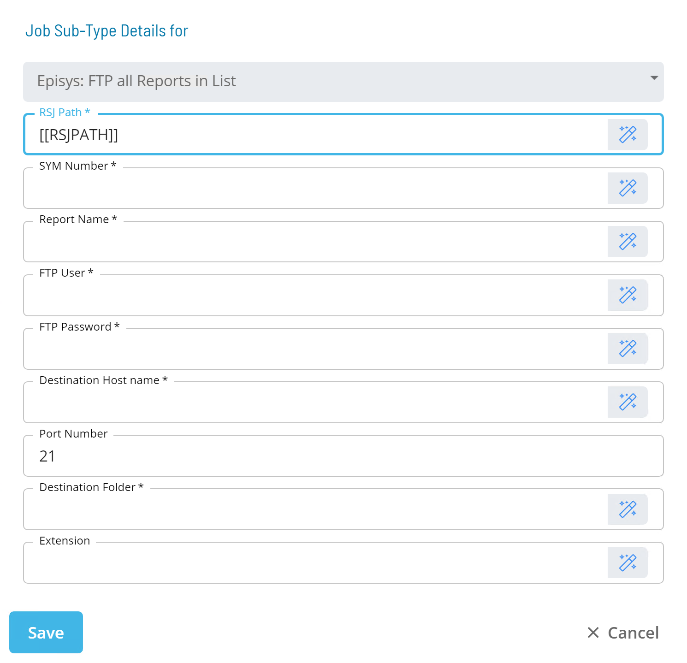

# Episys: FTP all Reports in List

* Calls an RSJ Utility called **optical_transfer**
* Takes a list of SEQ numbers and transfers the to another server.
* This list is created by a special Symitar repgen that prints just SEQ numbers to an output file.
* FTP must be enabled in order for this utility to work

### Sub-Type



| Field | Required / Optional | Description |
| --- | --- | --- |
| RSJ Path | Required | Defines the path to the directory on the UNIX Machine where the RSJ programs are installed. |
| SYM Number | Required | Defines the Episys "SYM" where the control file resides. The value should be a three-digit number or an OpCon token that resolves to a three-digit number. |
| Report Name | Required | Defines the name of the report whose sequence number is of interest. |
| FTP User | Required | Defines the name of the user which the files will be "FTPed" as. |
| FTP Password | Required | Defines the FTP User's Password. Some special characters have a special meaning to the UNIX shell and may be converted by the shell into other strings (such as '*'). These characters must be 'escaped' with a backslash. |
| Destination Host Name | Required | Defines the name of the Server the files will be sent to. |
| Port Number | Optional | Defines the FTP Port number to use. |
| Destination Folder | Required | Defines the directory to place the files on the destination Host machine. |
| Extension | Optional | Defines the optional parameter used to give the reports an extension. |

:::tip Best Practice

It is recommened that the values for RSJ Path, SYM Number, FTP User, and FTP Password fields reference Global or Schedule Properties with the appropriate values. 

* **PATH_RSJ** = ```/ops/bin/```
* **SI.SYM** = ```000```
* **FTP_User** = FTP User Name
* **FTP_Password** = FTP User's Password (can be encrypted)

:::

### optical_transfer Syntax

```/ops/bin/optical_transfer sym# sequence_number ftp_username ftp_password ftp_hostname[:port] ftp_directory_to_place_files [ftp_extension_to_append]```

| Parameter |	Required / Optional | Description |
| --- | --- | --- |
| ### | Required | Defines the Episys "SYM" where the control file resides. The value should be a three-digit number or an OpCon token that resolves to a three-digit number. |
| sequence_number | Required | Defines the name of the report whose sequence number is of interest. |
| ftp_username | Required | Defines the name of the user which the files will be "FTPed" as. |
| ftp_password | Required | Defines the FTP User's Password. Some special characters have a special meaning to the UNIX shell and may be converted by the shell into other strings (such as '*'). These characters must be 'escaped' with a backslash. |
| ftp_hostname | Required | Defines the name of the Server the files will be sent to. |
| port | Optional | Defines the FTP Port number to use. |
| ftp_directory_to_place_files | Required | Defines the directory to place the files on the destination Host machine. |
| ftp_extention_to_append | Optional | Defines the optional parameter used to give the reports an extension. |

:::tip Examples

Here are some command line examples:

* ```/ops/bin/optical_transfer 000 123456 ftp_username ftp_password FileShare[:21] "C:\Temp" .txt```
* ```/ops/bin/optical_transfer 000 456789 ftp_username ftp_password FileShare[:21] "C:\Temp" .txt```
:::

